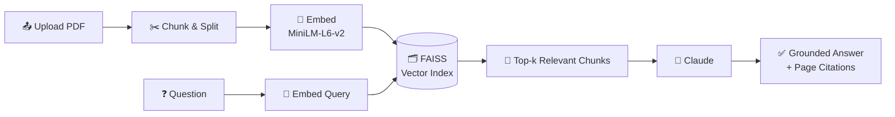

<div align="center">

# 📄 PDF RAG Tool

**Ask questions. Get answers grounded in your document. Every time.**


</div>

---

## 🧠 How it works



---

## ⚡ Quickstart

```bash
git clone https://github.com/YOUR_USERNAME/pdf-rag-tool.git
cd pdf-rag-tool
pip install -r requirements.txt
```

Create `.env`:

AICREDITS_API_KEY=sk-your-key-here

Run:
```bash
streamlit run app.py
```

---

## 🧩 Stack

| Layer            | Tool                          |
|-------------------|--------------------------------|
| UI               | Streamlit                     |
| PDF Parsing      | pypdf                         |
| Chunking         | langchain-text-splitters      |
| Embeddings       | sentence-transformers (local) |
| Vector Search    | FAISS                         |
| Generation       | Claude (via AICredits)        |

---

## 📁 Structure
pdf-rag-tool/
├── app.py               # Streamlit UI
├── ingestion.py          # PDF loading + chunking
├── embeddings_store.py    # Embeddings + FAISS index
├── rag_chain.py           # Retrieval + Claude generation
└── requirements.txt
---

## 🗺️ Roadmap

- [ ] Multi-document support
- [ ] Persistent index (skip re-embedding on restart)
- [ ] Confidence threshold to filter weak retrievals
- [ ] Additional tool types beyond PDF (part of a broader multi-tool hub)

---

<div align="center">
Built while learning the RAG pipeline from the ground up — loader, splitter, embeddings, vector store, and generation, each understood before it was wired together.
</div>